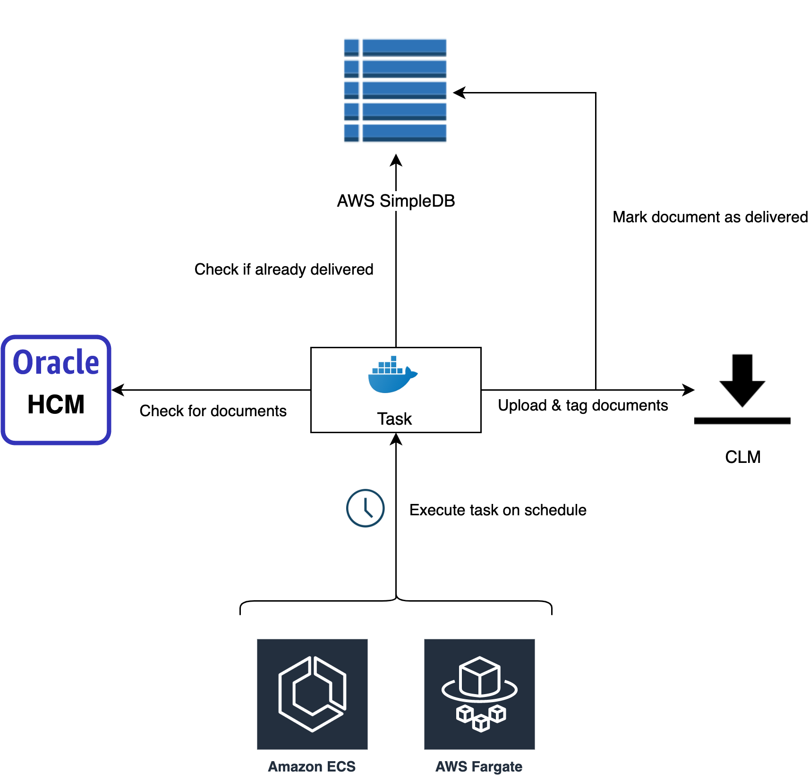

# Oracle HCM CLM Sync

## Description

This script connects to an Oracle HCM account and downloads any document
records for all employees and transfers them to a DocuSign CLM folder and
applies attributes.

## Definitions

* __Ruby__  - Dynamically typed, hackable, reflective, and categorically
  awesome programming language.
* __rvm (Ruby Version Manager)__ - A tool for managing multiple Ruby installations.
* __AWS (Amazon Web Services)__  - Amazon's SaaS platform that provides
  pay-for-what-you-use services for compute, storage, networking, and much
  more. See below for description on individual AWS services used in this
  application.
* __Containerization__ - A lightweight form of virtual computing wherein
  software is executed in a container engine instead of a guest OS.
* __Docker__ - A platform for building, managing, and executing containers.
* __Image/Container__ - An image is a prebuilt software unit that includes
  code, system and runtime libraries, dependencies, and configuration. When
  executed in a container engine (e.g. Docker), an image becomes a container.

## Configuration

This task is designed to be executed in AWS ECS, and as such is configured
with environment variables that can be defined in the task definition's
container config. The following environment variables are supported:

| Environment Variable | Description |
|----------------------|-------------|
| SPRINGCM_DATACENTER | The data center of the target SpringCM (DocuSign CLM) account, e.g. uatna11 |
| SPRINGCM_CLIENT_ID | The client ID used to access SpringCM (DocuSign CLM) via the REST API. |
| SPRINGCM_CLIENT_SECRET | The client secret used to access SpringCM (DocuSign CLM) via the REST API. |
| SIMPLEDB_DOMAIN | The SimpleDB domain used to check for previous deliveries and record new ones. |
| IAM_ACCESS_KEY_ID | Optional. Access key ID for an IAM user to access SimpleDB as. Supported for development purposes only, as the ECS task definition is assigned an execution role that has attached policies that grant access. |
| IAM_SECRET_ACCESS_KEY | Optional. Secret access key for an IAM user to access_key_id SimpleDB as. Like IAM_ACCESS_KEY_ID, this is intended for use in development only. |

## CLM Delivery & Attributes

Since this solution is designed for Prospect Medical, special consideration
is given to the fact that various entities under the Prospect Medical
umbrella have different routing configurations, including: attribute groups
& attributes, document types, personnel folder structures, etc.

There are four distinct configurations currently:

1. Prospect Medical Systems
2. Alta Hospitals (sometimes referred to as California Hospitals) — except
   Culver City
3. Culver City (part of the California Hospitals system but has a distinct
   attribute group and routing workflow)
4. PMH Hospitals — each of the five hospitals has a distinct folder structure
   and attribute group, although the routing workflow and smart rules in CLM
   are shared.

This project currently only targets entities that fall under #4, specifically:

1. Crozer-Keystone Health System
2. CharterCARE Health Partners
3. Waterbury Hospital
4. East Orange General Hospital
5. Eastern Connecticut Health Network

Since there is no explicit way to retrieve the actual entity that an employee
works at (HCM Work Relationship resources appears to be pointing at parent
companies like Prospect Medical Holdings, Inc. or Prospect Health Access
Network, Inc.), this task is configured to use the first digit of the
employee ID when determining which actual hospital to route to.

| First digit | Hospital |
|-------------|----------|
| 3 | Crozer-Keystone Health System |
|   | CharterCARE Health Partners |
|   | Waterbury Hospital |
|   | East Orange General Hospital |
|   | Eastern Connecticut Health Network |

## Delivery Logging

Container output is available in AWS CloudWatch under the `/caas` log group.
When a file is delivered and tagged, a record is added to AWS SimpleDB.
Future task executions will ignore documents that have been previously
delivered. The structure of a delivery record is as follows:

```json
{
  "document_record_id": "<Unique ID of the HCM document record>",
  "delivery_date": "<Timestamp the upload completed>",
  "clm_document_uid": "<UID of the document in CLM>"
}
```

## Reporting

Zoho Analytics is the go-to platform for business intelligence and reporting
for Stria, but there is no native support for using AWS SimpleDB to import
data. To get data about delivered files into Zoho, an AWS Lambda function is
used that generates a CSV file from all data in the provided SimpleDB domain
and uploads it to an AWS S3 bucket. From here, Zoho is able to download the
data on an interval using provided IAM credentials.

## Development & Deployment

To work on and/or deploy a new version of this task, you need the following
prerequisites:

1. Ruby (Rake and Bundler required)
2. AWS CLI
3. Docker
4. AWS IAM credentials (see credentials section below)

### The gist

1. Install [Docker](https://www.docker.com/get-started) and the [AWS CLI](https://aws.amazon.com/cli/)
2. Install [Ruby](https://www.ruby-lang.org/en/downloads/) 2.6, and required development gems:
   ```
   $ gem install bundler --version '~> 2.1'
   $ gem install rake --version '~> 13.0'
   ```
2. Install IAM credentials for this project. See [documentation](https://docs.aws.amazon.com/cli/latest/userguide/cli-configure-files.html)
   for more info. Credentials are available in [Smartsheet](https://app.smartsheet.com/sheets/Hgrj4VHJ7jgp352wRgPxwv3C9HHpCwpqxW6GcgP1?view=grid).
3. Make code changes
4. Login with Docker to the ECR repository (`rake login`)
5. Build container image (`rake build`)
6. Push container image (`rake push`)
7. Update task definition (might not be required if `latest` tag is used)

### Credentials

To push Docker images and modify ECS task definitions, you'll need an IAM
user with write access to both ECR and ECS. A console-enabled user is helpful
since it's a lot easier to update task definitions in the web console than
with the AWS CLI.

### Code

This application was developed with Ruby 2.6.0, but the newer versions should
work fine, as long as dependencies are compatible as well. The built images
use this exact Ruby version, so if you have rvm, use 2.6.0 for development.

### Build

To update the task with new code changes, you first need to build the Docker
image. This can easily be done using Rake:

```rb
$ rake build
$ rake build[my_sync_image,my_tag] # Build with custom image name & tag
```

The `build` task accepts three arguments: the image name, tag, and a boolean
value indicating whether latest should be applied, although this is only
considered if the tag argument is not `latest`—which is the default tag
argument value. For more information on using arguments in Rake tasks, see [here](https://ruby.github.io/rake/doc/rakefile_rdoc.html#label-Tasks+with+Arguments).

### Deploy

Changes are not deployed unless the ECS task definition is updated to use
the appropriate image tag. You can create a new task definition revision from
the AWS ECS web console. The task definition can also use the `latest` tag so
that it always gets the most recent code version, assuming the `latest` tag
was applied to the most recently pushed image.

## AWS

The infrastructure supporting this process is detailed below. The CaaS AWS
ECS cluster is used to execute task definitions for this process on a
schedule defined in AWS CloudWatch Events. The containerized code scans
Oracle HCM, and compares against an AWS SimpleDB domain to determine which
files have not yet been transferred to the target environment.



### AWS ECS (Elastic Container Service)

* Cluster: [CaaS](https://console.aws.amazon.com/ecs/home?region=us-east-1#/clusters/CaaS/services)
* Task definitions:
  1. [OracleHcmClmSyncUAT](https://console.aws.amazon.com/ecs/home?region=us-east-1#/taskDefinitions/OracleHcmClmSyncUAT/status/ACTIVE)
  2. [OracleHcmClmSyncProduction](https://console.aws.amazon.com/ecs/home?region=us-east-1#/taskDefinitions/OracleHcmClmSyncProduction/status/ACTIVE)
* Scheduled events: See [AWS CloudWatch Events section below](#cwe)

### AWS ECR (Elastic Container Registry)

* Repository: [cid00022/jid01171/oracle_hcm_clm_sync](https://console.aws.amazon.com/ecr/repositories/cid00022/jid01171/oracle_hcm_clm_sync/?region=us-east-1)

<h3 id="cwe">AWS CloudWatch Events</h3>

* Scheduled Events:
  1. [OracleHcmClmSyncUAT](https://console.aws.amazon.com/cloudwatch/home?region=us-east-1#rules:name=OracleHcmClmSyncUAT;accountId=681585688392)
  2. [OracleHcmClmSyncProduction](https://console.aws.amazon.com/cloudwatch/home?region=us-east-1#rules:name=OracleHcmClmSyncProduction)

### AWS CloudWatch Logs

* Log group: [/caas](https://console.aws.amazon.com/cloudwatch/home?region=us-east-1#logsV2:log-groups/log-group/$252Fcaas)
* Log streams:
  1. [JID01171/UAT/OracleHcmClmSync/\*](https://console.aws.amazon.com/cloudwatch/home?region=us-east-1#logsV2:log-groups/log-group/$252Fcaas$3FlogStreamNameFilter$3DJID01171$252FUAT$252FOracleHcmClmSync)
  2. [JID01171/Production/OracleHcmClmSync/\*](https://console.aws.amazon.com/cloudwatch/home?region=us-east-1#logsV2:log-groups/log-group/$252Fcaas$3FlogStreamNameFilter$3DJID01171$252FProduction$252FOracleHcmClmSync)
* Dashboards:
  1. [OracleHcmClmSyncUAT](https://console.aws.amazon.com/cloudwatch/home?region=us-east-1#dashboards:name=OracleHcmClmSyncUAT;accountId=681585688392)
  2. [OracleHcmClmSyncProduction](https://console.aws.amazon.com/cloudwatch/home?region=us-east-1#dashboards:name=OracleHcmClmSyncProduction;accountId=681585688392)

### AWS SimpleDB

* Domains:
  1. oracle_hcm_clm_sync_uat
  2. oracle_hcm_clm_sync_production

### AWS Lambda

* Function: [OracleHcmClmSyncSdbDump](https://console.aws.amazon.com/lambda/home?region=us-east-1#/functions/OracleHcmClmSyncSdbDump?tab=configuration)

### AWS S3

* Bucket: [caas.aws.stria.com](https://s3.console.aws.amazon.com/s3/buckets/caas.aws.stria.com/?region=us-east-1&tab=overview)
* Prefixes:
  1. [CID00022/JID01171/OracleHcmClmSyncSdbDump/Production](https://s3.console.aws.amazon.com/s3/buckets/caas.aws.stria.com/CID00022/JID01171/OracleHcmClmSyncSdbDump/Production/?region=us-east-1&tab=overview)
  2. [CID00022/JID01171/OracleHcmClmSyncSdbDump/UAT](https://s3.console.aws.amazon.com/s3/buckets/caas.aws.stria.com/CID00022/JID01171/OracleHcmClmSyncSdbDump/UAT/?region=us-east-1&tab=overview)

### AWS IAM

* User: [OracleHcmClmSyncUser](https://console.aws.amazon.com/iam/home?region=us-east-1#/users/OracleHcmClmSyncUser)
  * Directly assigned policies that allow pushing images to the ECR
    repository and reads/writes on the SimpleDB domain.
* User: [OracleHcmClmSyncZohoUser](https://console.aws.amazon.com/iam/home?region=us-east-1#/users/OracleHcmClmSyncZohoUser)
  * Directly assigned as policy that provides read-only access to the CSVs
    that contain delivery log records in S3.
* Role: [OracleHcmClmSyncLambdaRole](https://console.aws.amazon.com/iam/home?region=us-east-1#/roles/OracleHcmClmSyncLambdaRole)
  * Directly assigned policies that allow reads/writes on the SimpleDB
    domain, CloudWatch Logs access (creating log groups and putting events),
    and S3 access (for uploading generated CSVs).
